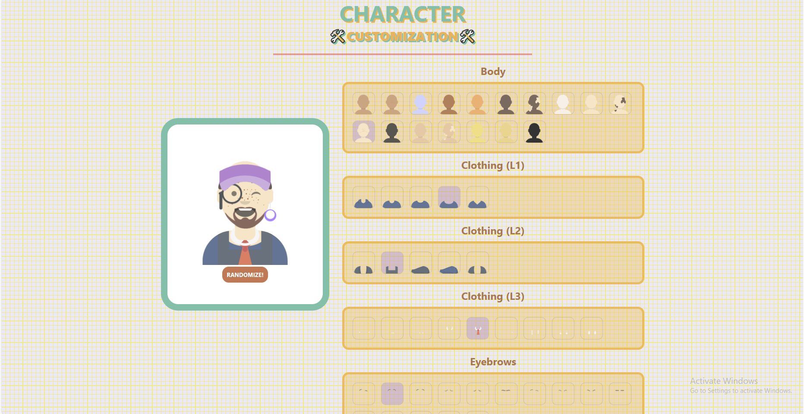
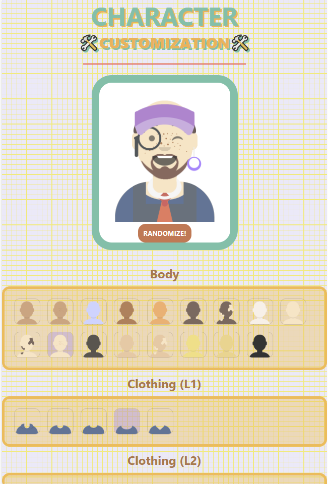
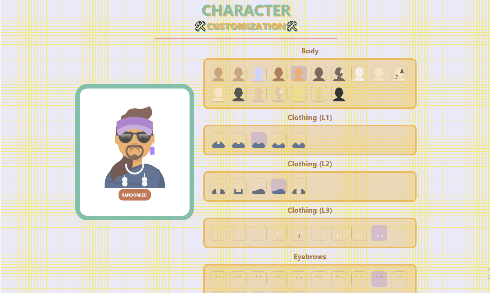
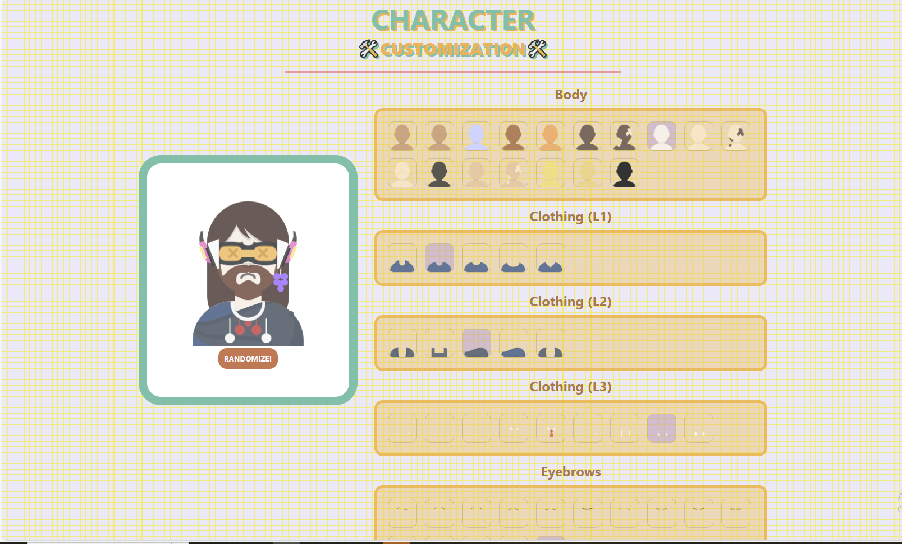

# Character Customize

## Demo link

Link of [demo](https://character-customization.netlify.app/)

## Run react app

```
npm start
```

## Page





## Customize person look

You can either click randomize button or click to the item that you want to change.




